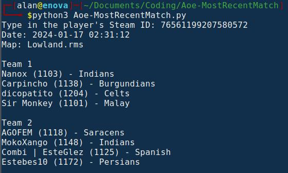

# AoE - MostRecentMatch #

A Python script that uses [LibreMatch API](https://wiki.librematch.org/steam/start) to output information about a player's most recent match in Age Of Empires II DE. 

This script:

**1. Retrieves match history:**

- Prompts the user to enter a Steam ID.
- Uses the `requests` library to fetch match history data from the Age of Empires 2 API for the specified Steam ID.

**2. Processes the match data:**

- Focuses on the most recent match played.
- Extracts information about the players involved in the match, including their aliases, civilizations, ELO ratings, and teams.
- Converts timestamps to human-readable dates.
- Replaces civilization IDs with their corresponding names for better readability.

**3. Presents the match summary:**

- Prints the date and map of the most recent match.
- Groups players by their teams and displays their information in a clear format, including aliases, ELOs, and civilizations.

Output:

